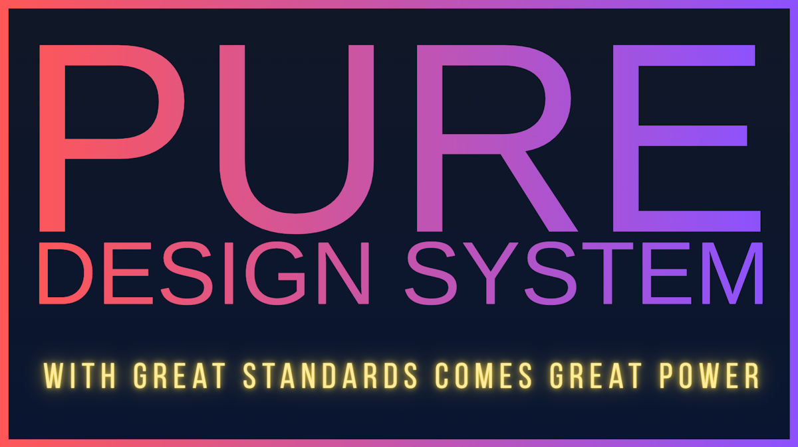

# Pure Design System (PDS)

> ⚠️ **Beta Software** - APIs are stabilizing but may still change. Pin versions in production: `"@pure-ds/core": "~0.5.6"`

[](https://github.com/mvneerven/pure-ds/actions/workflows/ci.yml)
[](#license)
[](https://www.npmjs.com/package/@pure-ds/core)



## With Great Standards Comes Great Power

**The browser is the framework. Semantic HTML is the component model. Web Standards are enough.**

PDS is a **configuration-first, standards-only design system generator**. Not a framework. Not a CSS library. Not tied to any toolchain.

You write a small JavaScript config. PDS generates:
- **Deterministic CSS** (global and Constructable Stylesheets for Web Components)
- **A complete token hierarchy** (inspect via `PDS.compiled` in DevTools)
- **Zero-specificity primitives** (`:where()` selectors—your CSS always wins)

Everything is optional. Use only tokens, or CSS, or add enhancements, or include components. Nothing forces itself into your project.

### The Config

```javascript
// pds.config.js
export const config = {
  design: {
    colors: { primary: '#007acc', secondary: '#5c2d91' },
    typography: { baseFontSize: 16, fontScale: 1.25 },
    spatialRhythm: { baseUnit: 8, scaleRatio: 1.5 }
  }
}
```

### The Result

```javascript
// app.js
import { PDS } from '@pure-ds/core';
import { config } from './pds.config.js';

await PDS.start(config);
// That's it. Start writing semantic HTML.
```

---

## The PDS Philosophy

### HTML and Semantic Classes First
PDS generates **high-level primitives** that style semantic HTML:

```html
<article class="card">...</article>
<button class="btn-primary">Save</button>
<div class="alert alert-success">Done!</div>
```

HTML is a great starting point. There's no need to have components for stuff that HTML can do on its own, or with the help of a pinch of CSS and/or a dash of JavaScript. The [Pure Web Manifesto](https://pureweb.dev/manifesto) is a great set of principles.

Also, PDS is not a component library. Yes, there are a couple of (optional, lazy-loaded, components), but they are only for more complex widgets, like a TabStrip, a Drag & Drop uploader, a Rich Text Editor, etc.


### Layout Utilities
A **small set** of layout utilities for composition:

```html
<div class="flex gap-md items-center">...</div>
<section class="stack-lg">...</section>
```

No `.text-blue-500`. No `.p-4`. No `.rounded-lg`. **Spacing, colors, radii are tokens—not classes.**

### Inline Styles? Only for Tokens
The **only** valid `style=""` in PDS sets CSS custom properties:

```html
<!-- ✓ Token override -->
<section style="--surface-bg: var(--color-primary-50);">

<!-- ✗ Never do this -->
<div style="display: flex; gap: 16px;">
```

---

## Why PDS Exists

| Other Libs | The PDS Way |
|-------------|-------------|
| `class="flex items-center gap-4 p-6 bg-white rounded-lg shadow-md"` | `class="card"` |
| `style="color: #007acc;"` | Uses `--color-primary-500` token |
| Import a `<Button>` component | `<button class="btn-primary">` |
| 47 utility classes per element | Semantic class + maybe one layout utility |

**The result:** Readable HTML. Inspectable CSS. Sites that work without JS. Code that lasts decades.

PDS follows the [Pure Web Manifesto](https://pureweb.dev/manifesto)—sustainable architecture for long-lived applications.

---

## Key Features

- 🎨 **Configuration-Driven** — Single source of truth generates everything
- 🚀 **Live or Static** — Runtime generation or pre-built CSS
- 🎯 **Framework Agnostic** — Vanilla, Lit, React, Vue, Svelte, Next.js
- 🌐 **Web Standards** — `HTMLElement` API, Constructable Stylesheets, Shadow DOM, etc.
- 🧩 **Progressive Enhancement** — Semantic HTML first, enhance where needed
- ♿ **Accessibility Built-in** — WCAG AA validation, contrast checking
- 📦 **Zero Build Required** — Works directly in browsers
- 📋 **IDE IntelliSense** — Full autocomplete via Custom Elements Manifest

---

## Table of Contents

- [The Three Layers](#the-three-layers)
- [Who is it For?](#who-is-it-for)
- [Getting Started](#getting-started)
- [Core Architecture](#core-architecture)
- [Styling Layers](#styling-layers)
- [Shadow DOM Adoption](#shadow-dom-adoption)
- [Icon System](#icon-system)
- [Smart Query System](#smart-query-system)
- [Design Validation](#design-validation)
- [Advanced Features](#advanced-features)
- [API Reference](#api-reference)
- [Extending PDS](#extending-pds)
- [Using from CDN](#using-from-cdn)
- [CLI & Export](#cli--export)
- [Custom Elements Manifest](#custom-elements-manifest)
- [Framework Integration](#framework-integration)
- [Troubleshooting](#troubleshooting)
- [License](#license)

---

## The Four Layers

PDS is built on **three fully optional layers**, each powered by your config, and a great DX layer on top:

### 1. Styles — Deterministic Global CSS

Your config generates:
- **Color scales** (50–900 from base colors)
- **Surface semantics** (bg, text, border, shadow, states)
- **Spacing system** (mathematical progression)
- **Typography scale** (modular scale from base)
- **Primitives** (`.btn-primary`, `.card`, `.badge`)
- **Utilities** (`.flex`, `.gap-md`, `.stack-lg`)

All exported as CSS Custom Properties. Zero specificity via `:where()`.
Same values available in JS via `PDS.compiled.tokens`.

### 2. Enhancements — Semantic HTML Made Powerful

Optional selector-based upgrades that run in Light DOM and Shadow DOM:
- Required fields show markers and help text automatically
- `<label data-toggle>` becomes a switch
- `<nav data-dropdown>` gets dropdown behavior
- `<dialog>` gets better focus management
- Form elements gain consistent theming

**Think: HTML → UX upgrades, zero integration work.**

### 3. Components — Auto-defined, Lazy-loaded Web Components

A growing set of PDS components:
- `<pds-icon>` — SVG sprite icons
- `<pds-drawer>` — Slide-out panels
- `<pds-tabstrip>` — Accessible tabs
- `<pds-form>` — Forms from JSON Schema
- `<pds-upload>` — Drag & drop file upload
- `<pds-richtext>` — Rich text / Markdown editor
- `<pds-splitpanel>` — Resizable panes
- `<pds-toaster>` — Toast notifications

Auto-defined when used. Lazy-loaded via dynamic imports. Styled by your tokens. Zero dependencies.


### 4: DX - Built-in Storybook & LLM Support

Install `@pure-ds/storybook` and get a cloned PDS Storybook instance right where you code, inside your project. Then add some `.stories.js` and see them immediately pop up.

Install `@pure-ds/core` and get instant PDS AI Coding Instrucions at your fingertips (GitHub Copilot & Cursor support built in)

### How It Works

It all starts with your `pds.confog.js` file in the root of the project (auto-generated when installing)

```
┌──────────────────────────────────────────────────────────────┐
│ Configuration                                                │
│ ─────────────                                                │
│ colors: { primary: '#007acc' }                               │
│ typography: { baseFontSize: 16, fontScale: 1.25 }            │
│ spatialRhythm: { baseUnit: 8 }                               │
└─────────────────────┬────────────────────────────────────────┘
                      │
                      ▼
┌──────────────────────────────────────────────────────────────┐
│ Generator (Live or Static)                                   │
│ ──────────────────────────                                   │
│ • Generates color scales (primary-50 → primary-900)          │
│ • Creates surface tokens (bg, text, border, shadow)          │
│ • Computes spacing progression (0-12)                        │
│ • Builds typography scale (6 levels)                         │
│ • Generates CSS layers (tokens → primitives → utilities)     │
│ • Validates contrast ratios (WCAG AA)                        │
└─────────────────────┬────────────────────────────────────────┘
                      │
                      ▼
┌──────────────────────────────────────────────────────────────┐
│ Output                                                       │
│ ──────                                                       │
│ Tokens:      --color-primary-500, --spacing-4                │
│ Primitives:  .btn-primary, .card, .badge                     │
│ Components:  <pds-drawer>, <pds-icon>                        │
│ Utilities:   .flex, .gap-md, .border-gradient                │
└──────────────────────────────────────────────────────────────┘
```

---

## Who is it For?

### 🎨 Design System Teams
- Generate multiple brand variants from a single codebase
- A/B test design directions by swapping configs
- Maintain consistency with centralized tokens
- Validate accessibility automatically

### 🚀 Product Teams
- Ship faster with auto-generated primitives
- Customize with JS config instead of SASS/CSS
- Work with any framework or no framework
- Reduce bundle size with lazy-loaded components

### 🛠️ Design Tool Builders
- Build live configurators with instant preview
- Export static bundles for production
- Query the system programmatically
- Access complete object model for introspection

### 👩‍💻 Developers
- Learn by exploring the interactive showcase
- Adopt incrementally (tokens only → full system)
- Extend with custom enhancers and components
- Debug with structured CSS layers

---

## Getting Started
See the full step-by-step guide in [getting-started.md](getting-started.md).

This covers the project starter, existing-project setup, CDN usage, Storybook, and core conventions.

---

## Core Architecture

PDS has three integrated systems that work together to create complete design systems.

### 1. Style Generation & Injection

The heart of PDS is the **Generator** - it transforms your configuration into structured CSS.

#### Token Generation

```javascript
// Your config
{
  colors: { primary: '#007acc' },
  typography: { baseFontSize: 16, fontScale: 1.25 },
  spatialRhythm: { baseUnit: 8, scaleRatio: 1.5 }
}

// PDS generates tokens
--color-primary-50    → #e6f7ff
--color-primary-100   → #b3e5ff
--color-primary-200   → #80d4ff
...
--color-primary-900   → #003d66

--spacing-0  → 0
--spacing-1  → 8px
--spacing-2  → 12px  (8 × 1.5)
--spacing-3  → 18px  (12 × 1.5)
...

--font-size-xs  → 0.64rem
--font-size-sm  → 0.8rem
--font-size-base → 1rem
--font-size-lg  → 1.25rem
--font-size-xl  → 1.5625rem
```

#### Surface Semantics

PDS generates smart surface tokens that adapt to context:

```css
/* Light theme */
--surface-bg: var(--color-gray-50);
--surface-text: var(--color-gray-900);
--surface-text-secondary: var(--color-gray-700);
--surface-border: var(--color-gray-300);
--surface-shadow: rgba(0, 0, 0, 0.1);

/* Dark theme (auto-generated) */
[data-theme="dark"] {
  --surface-bg: var(--color-gray-900);
  --surface-text: var(--color-gray-50);
  --surface-text-secondary: var(--color-gray-300);
  --surface-border: var(--color-gray-700);
  --surface-shadow: rgba(0, 0, 0, 0.5);
}
```

#### Interactive States

Button and interactive element states are computed automatically:

```css
/* Primary button */
--primary-fill: var(--color-primary-600);
--primary-fill-hover: var(--color-primary-700);
--primary-fill-active: var(--color-primary-800);

/* Text/outline buttons */
--primary-text: var(--color-primary-600);
--primary-text-hover: var(--color-primary-700);
```

#### Live vs Static Mode

**Live Mode:**
- CSS generated in-browser at runtime
- Instant updates when config changes
- Perfect for design tools and configurators
- Access via `PDS.compiled` object model
- Automatic font loading from Google Fonts

**Static Mode:**
- CSS pre-generated at build time
- Optimized for production performance
- Host anywhere (CDN, static server)
- Constructable Stylesheets for instant adoption
- No runtime overhead

### 2. Progressive Enhancements

Lightweight JavaScript behaviors applied to semantic HTML. These are **not Web Components** - just DOM enhancements that make standard HTML more interactive.

#### Built-in Enhancers

**Dropdown Menus** - `<nav data-dropdown>`

```html
<nav data-dropdown>
  <button>Menu</button>
  <menu>
    <li><a href="#home">Home</a></li>
    <li><a href="#about">About</a></li>
    <li><a href="#contact">Contact</a></li>
  </menu>
</nav>
```

Features:
- Click to toggle visibility
- Auto-positioning (up/down based on space)
- Horizontal alignment (`.align-right` class)
- Keyboard support (Escape to close)
- Click-outside to close
- Scrollable when content exceeds viewport

**Toggle Switches** - `<label data-toggle>`

```html
<label data-toggle>
  <span data-label>Enable notifications</span>
  <input type="checkbox">
</label>
```

Creates styled toggle switches from standard checkboxes.

**Range Sliders** - `<input type="range">`

```html
<!-- Standard mode: floating bubble on interaction -->
<label>
  <span>Volume</span>
  <input type="range" min="0" max="100" value="50">
</label>

<!-- Inline output mode: persistent value display -->
<label class="range-output">
  <span>Volume</span>
  <input type="range" min="0" max="100" value="50">
</label>
```

Enhances range inputs with automatic value display. Use `range-output` class for inline output with semantic `<output>` element.

**Required Field Indicators** - `form [required]`

```html
<label>
  <span>Email</span>
  <input type="email" required>
</label>
```

Automatically adds asterisk to label.

#### Custom Enhancers

Add your own progressive enhancements:

```javascript
await PDS.start({
  enhancers: [
    {
      selector: '[data-tooltip]',
      description: 'Adds tooltip on hover',
      run: (element) => {
        const text = element.dataset.tooltip;
        element.addEventListener('mouseenter', () => {
          // Show tooltip
        });
      }
    },
    {
      selector: '[data-copy]',
      description: 'Copy text to clipboard on click',
      run: (element) => {
        element.addEventListener('click', () => {
          navigator.clipboard.writeText(element.dataset.copy);
        });
      }
    }
  ]
});
```

### 3. Web Components

Rich, reusable UI components built with Lit. Lazy-loaded automatically via the **Auto-Define** system.

#### Available Components

**`<pds-icon>`** - SVG sprite icons
```html
<pds-icon icon="heart"></pds-icon>
<pds-icon icon="star" size="lg"></pds-icon>
<pds-icon icon="list" size="32" color="red"></pds-icon>
<pds-icon icon="info" label="Information"></pds-icon>
```

Attributes:
- `icon` - Symbol ID (required)
- `size` - Named size (xs/sm/md/lg/xl/2xl) or pixel value
- `color` - CSS color (defaults to currentColor)
- `label` - Accessible name (makes icon `role="img"`)

**`<pds-drawer>`** - Slide-out panels
```html
<pds-drawer id="menu" position="left">
  <h2 slot="header">Menu</h2>
  <nav>...</nav>
</pds-drawer>

<button onclick="document.getElementById('menu').open()">
  Open Menu
</button>
```

Attributes:
- `position` - left/right/top/bottom
- `open` - Boolean, controls visibility

Methods:
- `open()` - Show drawer
- `close()` - Hide drawer
- `toggle()` - Toggle visibility

**`<pds-tabstrip>`** - Accessible tab interface
```html
<pds-tabstrip>
  <button slot="tab">Overview</button>
  <div slot="panel">Overview content</div>
  
  <button slot="tab">Details</button>
  <div slot="panel">Details content</div>
</pds-tabstrip>
```

Features:
- Keyboard navigation (Arrow keys, Home, End)
- ARIA attributes automatic
- Focus management
- URL hash sync (optional)

**`<pds-upload>`** - File upload with preview
```html
<pds-upload 
  accept="image/*" 
  multiple
  max-size="5000000">
</pds-upload>
```

Attributes:
- `accept` - File types (MIME or extensions)
- `multiple` - Allow multiple files
- `max-size` - Max file size in bytes
- `max-files` - Max number of files

Events:
- `files-changed` - Fired when selection changes
- `file-error` - Fired on validation errors

**`<pds-toaster>`** - Toast notifications
```html
<pds-toaster id="toaster"></pds-toaster>

<script>
  const toaster = document.getElementById('toaster');
  toaster.show({
    message: 'Saved successfully!',
    type: 'success',
    duration: 3000
  });
</script>
```

Or use via events:
```javascript
PDS.dispatchEvent(new CustomEvent('pds:toast', {
  detail: {
    message: 'Error occurred',
    type: 'danger',
    duration: 5000
  }
}));
```

**`<pds-richtext>`** - Rich text editor
```html
<script type="importmap">
  {
    "imports": {
      "#showdown": "https://cdn.jsdelivr.net/npm/showdown@2.1.0/dist/showdown.mjs"
    }
  }
</script>

<pds-richtext
  value="<p>Initial content</p>"
  format="html">
</pds-richtext>
```

Set `format="markdown"` when you want the submitted form value to stay in Markdown:
```html
<pds-richtext name="release-notes" format="markdown"></pds-richtext>
```
The element will use the `#showdown` import-map specifier first, and will only fall back to loading the script from CDNs if that specifier is missing.

Features:
- Bold, italic, underline, strikethrough
- Headings, lists, links
- Code blocks
- Undo/redo
- Markdown shortcuts

**`<pds-form>`** - Dynamic forms from JSON Schema
```html
<pds-form schema='{"type":"object","properties":{...}}'></pds-form>
```

Generates complete forms with validation from JSON Schema.

**`<pds-splitpanel>`** - Resizable panes
```html
<pds-splitpanel orientation="horizontal">
  <div slot="start">Left pane</div>
  <div slot="end">Right pane</div>
</pds-splitpanel>
```

**`<pds-scrollrow>`** - Horizontal scrolling container
```html
<pds-scrollrow>
  <div class="card">Card 1</div>
  <div class="card">Card 2</div>
  <div class="card">Card 3</div>
</pds-scrollrow>
```

Shows scroll buttons when content overflows.

#### Auto-Define System

Components are registered automatically when their tags appear in the DOM:

```javascript
await PDS.start({
  autoDefine: {
    baseURL: '/auto-define/',
    
    // Eagerly load these components
    predefine: ['pds-icon', 'pds-drawer'],
    
    // Custom file mapping
    mapper: (tag) => {
      if (tag.startsWith('my-')) {
        return `/components/${tag}.js`;
      }
      // Return nothing to use PDS default mapping
    },
    
    // Advanced options
    scanExisting: true,      // Scan for tags on init
    observeShadows: true,    // Watch Shadow DOM
    patchAttachShadow: true, // Monitor dynamic shadows
    debounceMs: 16           // Debounce observation
  }
});
```

The system:
1. Observes DOM for new custom elements
2. Checks if tag is defined
3. Loads corresponding module
4. Registers custom element
5. Upgrades existing instances

> ⚠️ **Important: Programmatic Access to Auto-Defined Components**
>
> Components loaded via `autoDefine` are registered asynchronously. If you need to access component methods or properties programmatically (e.g., `toaster.toast()`), ensure the component is defined first:
>
> ```javascript
> // Wait for component to be defined
> await customElements.whenDefined('pds-toaster');
> const toaster = document.querySelector('pds-toaster');
> toaster.toast('Hello!');
> ```
>
> **Alternative:** Use `predefine` to eagerly load components at `PDS.start()` time:
>
> ```javascript
> await PDS.start({
>   autoDefine: {
>     predefine: ['pds-toaster', 'pds-icon'] // Loaded immediately
>   }
> });
> // Components are now available synchronously
> ```

---

## Styling Layers

PDS generates CSS in structured layers for predictable specificity and modularity.

### Layer Structure

```
┌──────────────────────────────────────────────────────────┐
│ tokens      CSS Custom Properties                        │
│             --color-*, --spacing-*, --font-*             │
├──────────────────────────────────────────────────────────┤
│ primitives  Base elements                                │
│             button, input, .card, .badge                 │
├──────────────────────────────────────────────────────────┤
│ components  Rich UI                                      │
│             .drawer, .tabstrip, .upload                  │
├──────────────────────────────────────────────────────────┤
│ utilities   Composable helpers                           │
│             .flex, .gap-4, .border-gradient              │
└──────────────────────────────────────────────────────────┘
```

### Layer Details

**Tokens** - Design foundation
- Colors (scales + semantics)
- Spacing (0-12 progression)
- Typography (families, sizes, weights)
- Borders (widths, radius)
- Shadows (depths)
- Transitions (speeds)
- Z-index (layers)
- Layout (breakpoints, max-width)

**Primitives** - Native elements enhanced
- Buttons (`.btn-primary`, `.btn-secondary`, `.btn-outline`)
- Forms (`input`, `select`, `textarea`, `fieldset`)
- Surfaces (`.card`, `.surface`)
- Badges (`.badge`, `.badge-success`)
- Callouts (`.callout`, `.callout-warning`)
- Typography (headings, paragraphs, lists)
- Tables (responsive, striped)

**Components** - Web Component styles
- Styles for `<pds-*>` elements
- Internal component structure
- State management (`:state()` selectors)

**Utilities** - Layout and effects
- Flex (`.flex`, `.flex-col`, `.items-center`)
- Grid (`.grid`, `.grid-cols-3`)
- Spacing (`.gap-4`, `.p-4`, `.m-2`)
- Borders (`.border`, `.border-gradient`, `.border-glow`)
- Effects (`.shadow-lg`, `.rounded-lg`)

### Accessing Layers

**In live mode:**
```javascript
const compiled = PDS.compiled;

// Get layer CSS
const tokensCSS = compiled.layers.tokens.css;
const primitivesCSS = compiled.layers.primitives.css;

// Get as stylesheet
const sheet = await PDS.registry.getStylesheet('primitives');
```

**In static mode:**
```javascript
// Import constructable stylesheets
import tokensSheet from '/pds/styles/pds-tokens.css.js';
import primitivesSheet from '/pds/styles/pds-primitives.css.js';
```

---

## Shadow DOM Adoption

PDS provides helpers for adopting styles into Shadow DOM.

### Basic Adoption

```javascript
class MyComponent extends HTMLElement {
  constructor() {
    super();
    this.attachShadow({ mode: 'open' });
  }
  
  async connectedCallback() {
    // Adopt just primitives (most common)
    await PDS.adoptPrimitives(this.shadowRoot);
    
    this.shadowRoot.innerHTML = `
      <button class="btn-primary">Click me</button>
    `;
  }
}
```

### Multiple Layers

```javascript
// Adopt specific layers
await PDS.adoptLayers(this.shadowRoot, ['primitives', 'components']);

// Adopt with custom styles
const myStyles = PDS.createStylesheet(`
  :host {
    display: block;
    padding: var(--spacing-4);
  }
`);

await PDS.adoptLayers(this.shadowRoot, ['primitives'], [myStyles]);
```

### Lit Component Example

```javascript
import { html, css, LitElement } from '#pds/lit';

class MyCard extends LitElement {
  static styles = css`
    :host {
      display: block;
    }
  `;
  
  async connectedCallback() {
    super.connectedCallback();
    await PDS.adoptPrimitives(this.shadowRoot);
  }
  
  render() {
    return html`
      <article class="card">
        <h3>Card Title</h3>
        <p>Card content</p>
        <button class="btn-primary">Action</button>
      </article>
    `;
  }
}
```

---

## Icon System

PDS uses SVG sprites for efficient icon rendering.

### Icon Component

```html
<!-- Basic usage -->
<pds-icon icon="heart"></pds-icon>

<!-- Sized icons -->
<pds-icon icon="star" size="sm"></pds-icon>
<pds-icon icon="star" size="lg"></pds-icon>
<pds-icon icon="star" size="32"></pds-icon>

<!-- Colored icons -->
<pds-icon icon="warning" color="red"></pds-icon>
<pds-icon icon="info" color="var(--color-primary-500)"></pds-icon>

<!-- Accessible icons -->
<pds-icon icon="list" label="Open navigation menu"></pds-icon>
```

### Configuration

```javascript
await PDS.start({
  design: {
    icons: {
      set: 'phosphor',           // Icon family
      weight: 'regular',          // Icon weight
      defaultSize: 24,            // Default size in pixels
      sizes: {                    // Named sizes
        xs: 16,
        sm: 20,
        md: 24,
        lg: 32,
        xl: 48,
        '2xl': 64
      },
      spritePath: '/assets/pds/icons/pds-icons.svg'
    }
  }
});
```

### Custom Icons

Add custom icons to the sprite:

**1. Configure custom icons:**
```javascript
// pds.config.js
export default {
  design: {
    icons: {
      set: 'phosphor',
      include: [
        'house', 'gear', 'heart', 'star', 
        'user', 'bell', 'search', 'menu'
      ]
    }
  }
};
```

**2. Rebuild sprite:**
```bash
npm run pds:build-icons
```

**3. Use in your app:**
```html
<pds-icon icon="house"></pds-icon>
```

### Icon Tokens

Icons are available as CSS custom properties:

```css
--icon-set: phosphor;
--icon-weight: regular;
--icon-size-xs: 16px;
--icon-size-sm: 20px;
--icon-size-md: 24px;
--icon-size-lg: 32px;
```

---

## Smart Query System

Ask questions about your design system using natural language.

### Usage

```javascript
// Programmatic API
const results = await PDS.query("what is the focus border color on inputs?");

results.forEach(result => {
  console.log(result.text);        // "Focus border color: var(--color-primary-500)"
  console.log(result.category);    // "Color Token"
  console.log(result.cssVar);      // "var(--color-primary-500)"
  console.log(result.code);        // Example code
});
```

### Example Queries

**Color Questions:**
```javascript
await PDS.query("what is the focus border color on inputs?")
await PDS.query("what foreground color should I use on this surface?")
await PDS.query("button hover color")
await PDS.query("primary color scale")
```

**Utility Questions:**
```javascript
await PDS.query("what are the utility classes for borders?")
await PDS.query("border gradient effect")
await PDS.query("flex layout utilities")
await PDS.query("gap between elements")
```

**Component Questions:**
```javascript
await PDS.query("how do I create an icon-only button?")
await PDS.query("drawer component")
await PDS.query("tab strip usage")
```

**Layout Questions:**
```javascript
await PDS.query("how can I group stuff in containers?")
await PDS.query("grid container")
await PDS.query("card component")
```

### AutoComplete Integration

The query system integrates with `#pds-search` in the configurator. Type queries directly in the search box for instant answers.

### How It Works

1. **Intent Detection** - Recognizes what you're asking about (color, spacing, component, utility)
2. **Entity Recognition** - Identifies design elements (button, input, surface)
3. **Context Analysis** - Detects states (hover, focus, active)
4. **Data Querying** - Searches `PDS.compiled`, `PDS.ontology`, `PDS.currentConfig`
5. **Scoring & Ranking** - Returns top 10 most relevant results

See [PDS-QUERY-SYSTEM.md](./PDS-QUERY-SYSTEM.md) for detailed documentation.

---

## Design Validation

PDS automatically validates designs for accessibility issues.

### Automatic Validation

In live mode with presets enabled:

```bash
npm run build
```

Validates all presets during build and reports issues:

```
❌ Preset validation failed:

— Travel Market
  • Primary text on surface is too low (3.95 < 4.5)
    [light/outline] (/colors/primary)

— Mobility App  
  • Primary button contrast too low in dark theme (2.85 < 4.5)
    [dark/btn-primary] (/colors/darkMode/primary)
```

### Manual Validation

```javascript
import { validateDesign } from '@pure-ds/core/pds-core/pds-generator.js';

const result = validateDesign({
  colors: {
    primary: '#007acc',
    background: '#ffffff'
  }
}, {
  minContrast: 4.5 // WCAG AA standard
});

if (!result.ok) {
  console.table(result.issues);
  // [
  //   {
  //     path: '/colors/primary',
  //     message: 'Primary button contrast too low...',
  //     ratio: 3.2,
  //     min: 4.5,
  //     context: 'light/btn-primary'
  //   }
  // ]
}
```

### Batch Validation

```javascript
import { validateDesigns } from '@pure-ds/core/pds-core/pds-generator.js';

const results = validateDesigns([
  { name: 'Light', config: {...} },
  { name: 'Dark', config: {...} }
], {
  minContrast: 4.5
});

results.forEach(({ name, ok, issues }) => {
  if (!ok) {
    console.log(`${name} has ${issues.length} issues`);
  }
});
```

### Validation Checks

- **Primary Button (Light)** - Button fill vs white text
- **Primary Button (Dark)** - Button fill vs white text in dark mode
- **Surface Text (Light)** - Text color vs surface background
- **Primary Links/Outline (Light)** - Primary text vs surface
- **Surface Text (Dark)** - Text color vs dark surface

All checks verify WCAG AA minimum contrast ratio (4.5:1 default).

---

## Advanced Features

### Automatic Font Loading

In live mode, PDS automatically loads fonts from Google Fonts when they're not available locally.

```javascript
await PDS.start({
  mode: 'live',
  design: {
    typography: {
      fontFamilyHeadings: 'Inter, sans-serif',
      fontFamilyBody: 'Inter, sans-serif',
      fontFamilyMono: 'Fira Code, monospace'
    }
  }
});

// Fonts are automatically loaded from Google Fonts if needed
```

**Features:**
- Smart detection (skips system fonts)
- Parallel loading for performance
- Font weights: 400, 500, 600, 700
- `font-display: swap` for better UX
- 5-second timeout prevents hanging

**Manual loading:**
```javascript
import { loadGoogleFont } from '@pure-ds/core/common/font-loader';

await loadGoogleFont('Roboto', {
  weights: [400, 500, 700],
  italic: true
});
```

### Event Bus

PDS is an EventTarget - listen for system events:

```javascript
// System ready
PDS.addEventListener('pds:ready', (e) => {
  console.log('PDS ready:', e.detail.mode);
});

// Theme changed
PDS.addEventListener('pds:theme:changed', (e) => {
  console.log('Theme:', e.detail.theme);
});

// Design updated (configurator)
PDS.addEventListener('pds:design:updated', (e) => {
  console.log('New config:', e.detail.config);
});

// Error handling
PDS.addEventListener('pds:error', (e) => {
  console.error('PDS error:', e.detail.error);
});
```

**Available events:**
- `pds:ready` - System initialized
- `pds:error` - Error occurred
- `pds:theme:changed` - Theme switched
- `pds:design:updated` - Config changed
- `pds:design:field:changed` - Single field updated
- `pds:inspector:mode:changed` - Inspector toggled
- `pds:inspector:deactivate` - Inspector close requested
- `pds:docs:view` - Documentation view requested
- `pds:toast` - Toast notification triggered

### Theme Management

```javascript
// Get current theme
const theme = PDS.theme; // 'light' | 'dark' | 'system' | null

// Set theme
PDS.theme = 'dark';
PDS.theme = 'system'; // Follows OS preference
PDS.theme = null;     // Remove preference
```

Theme is stored in localStorage and updates `html[data-theme]` automatically.

### Compiled Object Model

In live mode, access the complete generated system:

```javascript
const compiled = PDS.compiled;

// Tokens
compiled.tokens.colors.primary[500];
compiled.tokens.spacing[4];
compiled.tokens.typography.fontFamily.body;

// Layers
compiled.layers.tokens.css;
compiled.layers.primitives.css;

// Metadata
compiled.meta.generatedAt;
compiled.meta.totalSize;
compiled.meta.tokenGroups;

// Helpers
compiled.helpers.getColorScales();
compiled.helpers.getColorScale('primary');
compiled.helpers.getSpacingValues();
```

### Presets

Choose from built-in presets:

```javascript
// View available presets
Object.keys(PDS.presets);
// ['default', 'ocean-breeze', 'midnight-steel', ...]

// Use a preset
await PDS.start({
  preset: 'ocean-breeze',
  design: {
    // Override specific values
    colors: { primary: '#custom' }
  }
});

// Access preset config
const preset = PDS.presets['ocean-breeze'];
console.log(preset.colors.primary);
```

**Available presets:**
- `default` - Clean, modern baseline
- `ocean-breeze` - Cool blues and teals
- `midnight-steel` - Dark, professional
- `sunset-vibes` - Warm oranges and purples
- `forest-calm` - Natural greens
- `lavender-dream` - Soft purples
- `coral-energy` - Vibrant pinks and oranges
- `arctic-frost` - Cool grays and blues
- `golden-hour` - Warm yellows and golds
- `neon-city` - Bright, high-contrast
- `travel-market` - Earthy, adventurous
- `mobility-app` - Tech-forward transportation

---

## API Reference

### PDS.start(config)

Main initialization method.

```typescript
await PDS.start({
  // Mode
  mode?: 'live' | 'static' = 'live',
  
  // Design configuration
  preset?: string,
  design?: {
    colors?: {...},
    typography?: {...},
    spatialRhythm?: {...},
    shape?: {...},
    behavior?: {...},
    layout?: {...},
    layers?: {...},
    icons?: {...}
  },
  
  // Static mode paths
  staticPaths?: {
    tokens?: string,
    primitives?: string,
    components?: string,
    utilities?: string,
    styles?: string
  },
  
  // Component loading
  autoDefine?: {
    baseURL?: string,
    predefine?: string[],
    mapper?: (tag: string) => string | void,
    scanExisting?: boolean,
    observeShadows?: boolean,
    patchAttachShadow?: boolean,
    debounceMs?: number
  },
  
  // Progressive enhancements
  enhancers?: Array<{
    selector: string,
    description?: string,
    run: (element: Element) => void
  }>,
  
  // Runtime options
  applyGlobalStyles?: boolean = false,
  manageTheme?: boolean = false,
  themeStorageKey?: string = 'pure-ds-theme',
  preloadStyles?: boolean = false,
  criticalLayers?: string[] = ['tokens', 'primitives']
});
```

### PDS.query(question)

Smart query interface.

```typescript
const results = await PDS.query(question: string);
// Returns array of results with text, value, icon, category, etc.
```

### validateDesign(config, options)

Validate design for accessibility.

```typescript
import { validateDesign } from '@pure-ds/core/pds-core/pds-generator.js';

const result = validateDesign(config, { minContrast: 4.5 });
// Returns: { ok: boolean, issues: Array }
```

### PDS.adoptLayers(shadowRoot, layers, additionalSheets)

Adopt stylesheets into Shadow DOM.

```typescript
await PDS.adoptLayers(shadowRoot, ['primitives'], [customSheet]);
```

### PDS.adoptPrimitives(shadowRoot, additionalSheets)

Adopt primitives layer (convenience method).

### PDS.createStylesheet(css)

Create constructable stylesheet from CSS string.

### PDS Properties

```typescript
PDS.registry               // Runtime registry
PDS.getGenerator()          // Live-only Generator accessor
PDS.ontology               // Design system metadata (live-only)
PDS.presets                // Built-in presets (live-only)
PDS.enums                  // Enumeration values (live-only)
PDS.currentConfig          // Current configuration (read-only)
PDS.compiled               // Compiled state (live mode only)
PDS.theme                  // Current theme (getter/setter)
PDS.defaultEnhancers       // Built-in enhancements
```

---

## Extending PDS

### Custom Enhancers

```javascript
await PDS.start({
  enhancers: [
    {
      selector: '[data-animate-in]',
      description: 'Animate elements as they enter viewport',
      run: (element) => {
        const observer = new IntersectionObserver((entries) => {
          entries.forEach(entry => {
            if (entry.isIntersecting) {
              element.classList.add('animated');
              observer.unobserve(element);
            }
          });
        });
        observer.observe(element);
      }
    }
  ]
});
```

### Custom Components

```javascript
await PDS.start({
  autoDefine: {
    mapper: (tag) => {
      if (tag.startsWith('my-')) {
        return `/components/${tag}.js`;
      }
      // Let PDS handle pds-* components
    }
  }
});
```

### Custom Presets

```javascript
export const myPreset = {
  id: 'my-brand',
  name: 'My Brand Theme',
  colors: { primary: '#007acc', secondary: '#5c2d91' },
  typography: { fontFamilyHeadings: 'Montserrat' }
};

await PDS.start({ design: myPreset });
```

---

## Using from CDN

```html
<!DOCTYPE html>
<html lang="en">
<head>
  <script type="importmap">
  {
    "imports": {
      "#pds/lit": "https://cdn.jsdelivr.net/npm/lit@3/index.js"
    }
  }
  </script>
</head>
<body>
  <button class="btn-primary">Click me</button>
  
  <script type="module">
    import { PDS } from 'https://cdn.jsdelivr.net/npm/@pure-ds/core@latest/public/assets/js/pds.js';
    
    await PDS.start({
      mode: 'static',
      staticPaths: {
        tokens: 'https://cdn.jsdelivr.net/npm/@pure-ds/core@latest/public/assets/pds/styles/pds-tokens.css.js',
        primitives: 'https://cdn.jsdelivr.net/npm/@pure-ds/core@latest/public/assets/pds/styles/pds-primitives.css.js',
        utilities: 'https://cdn.jsdelivr.net/npm/@pure-ds/core@latest/public/assets/pds/styles/pds-utilities.css.js'
      },
      autoDefine: {
        baseURL: 'https://cdn.jsdelivr.net/npm/@pure-ds/core@latest/public/assets/pds/components/'
      },
      applyGlobalStyles: true
    });
  </script>
</body>
</html>
```

---

## CLI & Build

### Available Scripts

| Script | Description |
|--------|-------------|
| `npm run pds:build` | Full build: styles, components, icons, and IntelliSense data |
| `npm run pds:dx` | Generate all IntelliSense data (HTML + CSS) |
| `npm run pds:manifest` | Generate HTML IntelliSense (Custom Elements Manifest) |
| `npm run pds:css-data` | Generate CSS IntelliSense (tokens, classes, attributes) |
| `npm run pds:build-icons` | Build custom icon sprite |
| `npm run sync-assets` | Sync assets between locations |
| `npx pds-init-config` | Create default `pds.config.js` with helpful examples |

### Initialize Configuration

Create a starter `pds.config.js` file with commented examples:

```bash
# Create config in current directory
npx pds-init-config

# Force overwrite existing config
npx pds-init-config --force
```

This generates a `pds.config.js` with:
- Basic `mode` and `preset` settings
- Commented examples for design token overrides
- Template for custom progressive enhancers
- Template for lazy-loaded component configuration

**Note:** During `npm install`, PDS automatically creates this file if it doesn't exist.

### Build Static Assets

```bash
npm run pds:build
```

**Output:**
```
pds/
├── styles/
│   ├── pds-tokens.css
│   ├── pds-tokens.css.js
│   ├── pds-primitives.css
│   ├── pds-primitives.css.js
│   ├── pds-components.css
│   ├── pds-components.css.js
│   ├── pds-utilities.css
│   ├── pds-utilities.css.js
│   └── pds-styles.css.js
├── components/
│   └── pds-*.js (all components)
├── icons/
│   └── pds-icons.svg
├── custom-elements.json         # HTML IntelliSense
├── vscode-custom-data.json      # HTML IntelliSense (VS Code)
├── pds.css-data.json            # CSS IntelliSense (VS Code)
└── pds-css-complete.json        # CSS IntelliSense (all editors)
```

### Generate IntelliSense Data

For complete IDE support with autocomplete:

```bash
# Generate both HTML and CSS IntelliSense (recommended)
npm run pds:dx

# Or generate individually
npm run pds:manifest    # HTML component autocomplete
npm run pds:css-data    # CSS token & class autocomplete
```

See [INTELLISENSE.md](./INTELLISENSE.md) for setup instructions.

### Configuration

```javascript
// pds.config.js
export default {
  staticBase: 'pds',
  static: { root: 'public/assets/pds/' },
  preset: 'default',
  design: { colors: { primary: '#007acc' } }
};
```

### Build Icons

```bash
npm run pds:build-icons
```

### Sync Assets

```bash
npm run sync-assets
```

---

## IntelliSense & IDE Support

PDS provides comprehensive IntelliSense support for both HTML and CSS, dramatically improving developer experience with autocomplete, documentation, and type hints.

> 📖 **[Full IntelliSense Guide](./INTELLISENSE.md)** - Detailed setup for all editors

### Quick Setup (VS Code)

Add to `.vscode/settings.json`:

```json
{
  "html.customData": [
    "node_modules/@pure-ds/core/public/assets/pds/vscode-custom-data.json"
  ],
  "css.customData": [
    "node_modules/@pure-ds/core/public/assets/pds/pds.css-data.json"
  ]
}
```

Reload VS Code: **Ctrl+Shift+P** → **Developer: Reload Window**

### What You Get

#### HTML IntelliSense
- ✅ Web component autocomplete (`<pds-drawer>`, `<pds-icon>`)
- ✅ Attribute suggestions with descriptions
- ✅ Enum value autocomplete (`position="left|right|top|bottom"`)
- ✅ Icon name suggestions (all available icons)

#### CSS IntelliSense
- ✅ CSS token autocomplete in `.css` files and `<style>` tags
- ✅ Token value previews on hover (`--color-primary-500`, `--spacing-4`)
- ✅ 165 CSS custom properties with descriptions
- ⚠️ **Note**: Inline `style` attributes don't support IntelliSense (VS Code limitation - use CSS files or `<style>` tags)

> 📖 **[CSS IntelliSense Limitations](./CSS-INTELLISENSE-LIMITATION.md)** - Important info about where IntelliSense works

### Generation

IntelliSense data is automatically generated with build:

```bash
# Generate all IntelliSense data (HTML + CSS)
npm run pds:dx

# Or as part of full build
npm run pds:build

# Or generate individually
npm run pds:manifest    # HTML IntelliSense only
npm run pds:css-data    # CSS IntelliSense only
```

### Generated Files

```
public/assets/pds/
├── custom-elements.json        # Standard Custom Elements Manifest
├── vscode-custom-data.json     # VS Code HTML custom data
├── pds.css-data.json           # VS Code CSS custom data
└── pds-css-complete.json       # Standard CSS data (all editors)

# Root reference files
pds.html-data.json               # Points to HTML custom data
pds.css-data.json                # Points to CSS custom data
```

### Usage Examples

**HTML Autocomplete:**
```html
<!-- Type <pds- to see all components -->
<pds-drawer position="right" open>
  <div slot="drawer-header">Settings</div>
</pds-drawer>

<!-- Icon autocomplete suggests all available icons -->
<pds-icon icon="star"></pds-icon>
```

**CSS Token Autocomplete:**
```css
.my-component {
  /* Type --color and see all color tokens */
  background: var(--color-primary-500);
  padding: var(--spacing-4);
  border-radius: var(--radius-md);
  box-shadow: var(--shadow-lg);
}
```

**Utility Class Autocomplete:**
```html
<div class="flex gap-4 items-center">
  <div class="card surface-elevated">
    <!-- Primitives and utilities autocomplete -->
  </div>
</div>
```

### What's Included

**150+ CSS Custom Properties:**
- Colors: `--color-{name}-{50-900}`
- Spacing: `--spacing-{xs|sm|md|lg|xl|...}`
- Typography: `--font-family-*`, `--font-size-*`, `--font-weight-*`
- Borders: `--radius-*`, `--border-width-*`
- Shadows: `--shadow-{sm|md|lg|xl|2xl}`
- Surfaces: `--surface-bg`, `--surface-text`, `--surface-border`

**50+ CSS Classes:**
- Primitives: `.badge`, `.card`, `.surface`, `.callout`
- Layout: `.flex`, `.grid`, `.grid-cols-{1-6}`, `.container`
- Utilities: `.gap-{0-12}`, `.items-*`, `.justify-*`
- Effects: `.border-gradient`, `.border-glow`

**5+ Data Enhancements:**
- `data-dropdown`, `data-toggle`, `data-tabs`, `data-modal`, `data-tooltip`

### Cross-Editor Support

PDS IntelliSense works with:
- ✅ **VS Code** - Full support (HTML + CSS)
- ✅ **WebStorm/IntelliJ** - Automatic recognition
- ✅ **Sublime Text** - Via LSP package
- ✅ **Vim/Neovim** - Via coc-css/coc-html
- ✅ **Any LSP-compliant editor**

See [INTELLISENSE.md](./INTELLISENSE.md) for detailed setup instructions for each editor.

---

## Custom Elements Manifest

PDS automatically generates a [Custom Elements Manifest](https://github.com/webcomponents/custom-elements-manifest) for web component documentation. This is part of the IntelliSense system but can be used standalone.

### What's Documented
- Properties, attributes, methods, events
- Slots and CSS custom properties
- CSS parts for Shadow DOM styling

See the [IntelliSense Guide](./INTELLISENSE.md) for complete documentation.
- 📖 **Hover documentation** - View descriptions without leaving your code

For detailed information, see [CUSTOM-ELEMENTS-MANIFEST.md](./CUSTOM-ELEMENTS-MANIFEST.md).

---

## Framework Integration

### Vite

```javascript
// vite.config.js
export default {
  resolve: {
    alias: { '#pds/lit': 'lit' }
  }
};

// main.js
import { PDS } from '@pure-ds/core';
await PDS.start({ design: { colors: { primary: '#007acc' } } });
```

### Next.js

```javascript
// app/layout.tsx
'use client';

import { useEffect } from 'react';
import { PDS } from '@pure-ds/core';

export default function RootLayout({ children }) {
  useEffect(() => {
    PDS.start({ mode: 'static', applyGlobalStyles: true });
  }, []);
  
  return <html><body>{children}</body></html>;
}

// next.config.js
module.exports = {
  webpack: (config) => {
    config.resolve.alias['#pds/lit'] = 'lit';
    return config;
  }
};
```

### React

```javascript
import { useEffect } from 'react';
import { PDS } from 'pure-ds';

function App() {
  useEffect(() => {
    PDS.start({ design: { colors: { primary: '#007acc' } } });
  }, []);
  
  return <button className="btn-primary">Click me</button>;
}
```

### Vue

```javascript
// main.js
import { PDS } from 'pure-ds';
await PDS.start({ design: { colors: { primary: '#007acc' } } });

// vite.config.js
export default {
  resolve: { alias: { '#pds/lit': 'lit' } }
};
```

---

## Troubleshooting

### Components Not Loading

1. Verify components directory exists
2. Check import map for `#pds/lit` (required for Lit components - see below)
3. Manually sync: `node node_modules/pure-ds/packages/pds-cli/bin/postinstall.js`
4. Check browser console for errors

### Lit Components Not Working

**Symptoms:** `<pds-form>` or other Lit-based components fail to load with module resolution errors.

**Components requiring Lit:**
- `<pds-form>` - JSON Schema forms
- `<pds-drawer>` - Drawer/sidebar panels

**Solution:** Add import map to your HTML `<head>`:

```html
<script type="importmap">
{
  "imports": {
    "#pds/lit": "/assets/js/lit.js"
  }
}
</script>
```

Or in bundlers (Vite, Webpack, etc.):

```javascript
// vite.config.js
export default {
  resolve: {
    alias: { '#pds/lit': 'lit' }
  }
};

// webpack.config.js
module.exports = {
  resolve: {
    alias: { '#pds/lit': 'lit' }
  }
};
```

**Note:** Wait for components to load before accessing their APIs:

```javascript
// ❌ Don't do this
const form = document.querySelector('pds-form');
form.getFormData(); // May fail if component not loaded yet

// ✅ Do this instead
await customElements.whenDefined('pds-form');
const form = document.querySelector('pds-form');
form.getFormData(); // Safe
```

### Flash of Unstyled Content

```javascript
await PDS.start({
  preloadStyles: true,
  criticalLayers: ['tokens', 'primitives']
});
```

### Theme Not Changing

Enable theme management:
```javascript
await PDS.start({ manageTheme: true });
PDS.theme = 'dark';
```

### Fonts Not Loading

Check font names are correct:
```javascript
design: {
  typography: {
    fontFamilyHeadings: 'Inter, sans-serif' // Exact name
  }
}
```

---

## Contributing

Contributions welcome! See [CONTRIBUTING.md](./CONTRIBUTING.md).

```bash
git clone https://github.com/mvneerven/pure-ds.git
cd pure-ds
npm install
npm run dev
```

---

## License

**ISC License** - See [LICENSE](./LICENSE)

---

## Links

- 🌐 **Homepage:** https://puredesignsystem.z6.web.core.windows.net/
- 📦 **NPM:** https://www.npmjs.com/package/pure-ds
- 🐙 **GitHub:** https://github.com/mvneerven/pure-ds
- 📖 **Docs:** [getting-started.md](./getting-started.md) | [PDS-QUERY-SYSTEM.md](./PDS-QUERY-SYSTEM.md)
- 💬 **Discussions:** https://github.com/mvneerven/pure-ds/discussions
- 🐛 **Issues:** https://github.com/mvneerven/pure-ds/issues

---

**Made with ❤️ for the open web**


